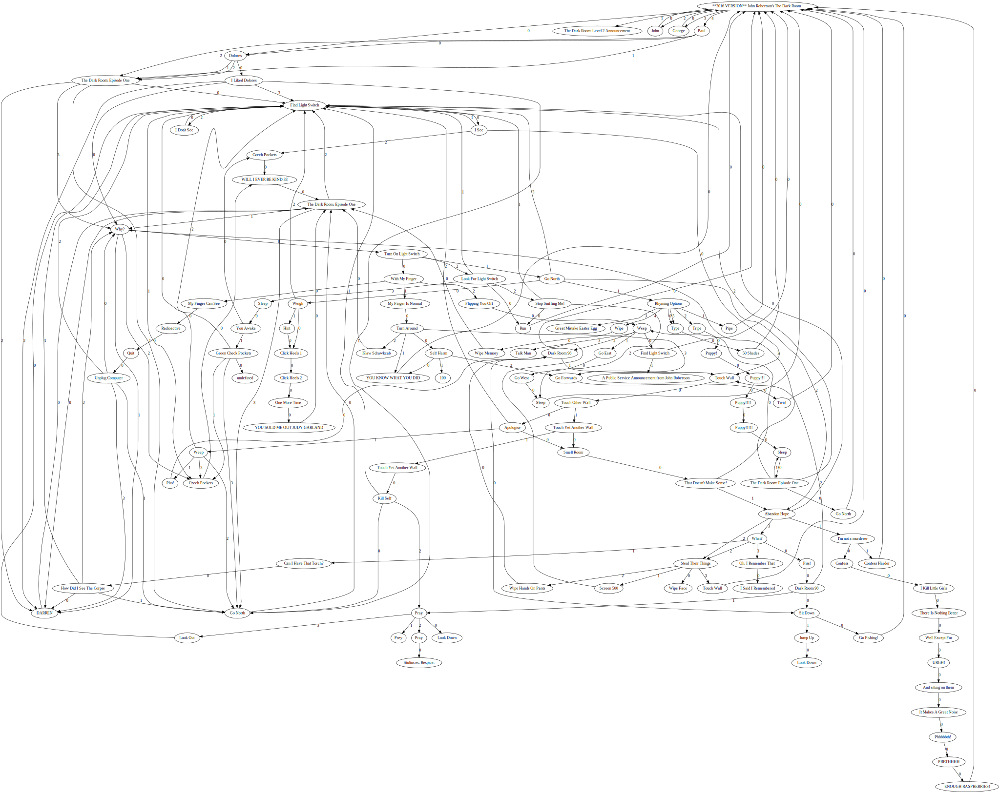
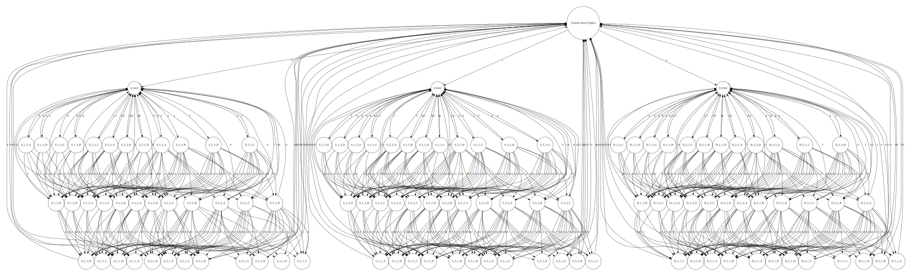

## Youtube Adventure Mapper

Some intrepid, possibly slightly mad, people on youtube like to create choose your own adventure games using videos and annotations which link to other videos.

One example is [The Dark Room](https://www.youtube.com/watch?v=OqozGZXYb1Y) by Australian comedian John Robertson.

This tool allows you to map these adventure games.

## Why?
It was all Ed's idea. Ed is a John Robertson fan and wanted to map out his YouTube game, The Dark Room.
So, here we are...

Ed can be found at the [Glasgow Coder Collective](https://glasgowcodercollective.herokuapp.com/) and also has his own GitHub page at [L3gomancer](https://github.com/L3gomancer).


## Usage

`node youtube-adventure-mapper.js [url]`

Run it without providing a url and it will scrape the annotations of [The Dark Room](https://www.youtube.com/watch?v=OqozGZXYb1Y).

## Output
The output consists of two files:

 * output.json - a JSON representation of the videos and their annotation links to other videos.

 * output.dot - can plotted as a graph using the graphvis dot command.

 The DOT output can be turned into a fabulous visualisation using the command `dot -Tsvg ./output.dot > output.svg`.

## Examples
The repository contains examples of maps generated from these three youtube games:

 * [The Dark Room (2016)](https://www.youtube.com/watch?v=Jm-Kmw8pKXw)
 * [Choose Your Adventure](https://www.youtube.com/watch?v=OqozGZXYb1Y)
 * [Youtube Street Fighter](https://wwhttps://www.youtube.com/watch?v=LPQ1XrllZmA)


 An example of the two output files and an svg graph are all available in this repository.

### The Dark Room


### Choose Your Adventure


### Street Fighter
Note that the dot file for this was modified to increase the vertical node spacing and make it more readable.

The changes were as follows:
```
digraph {
  graph [pad="0.5", nodesep="0", ranksep="3"];
  node[shape = circle]
  ...
```



